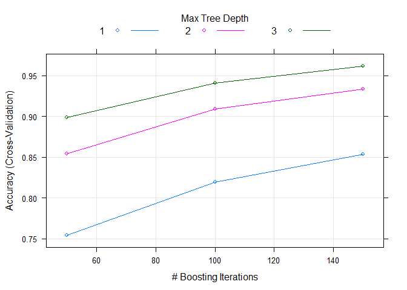

### 1. Title

predict the manner in which they did the exercise among belt, forearm,
arm, and dumbell.

### 2. Synopsys

Using devices such as Jawbone Up, Nike FuelBand, and Fitbit it is now
possible to collect a large amount of data about personal activity
relatively inexpensively. These type of devices are part of the
quantified self movement - a group of enthusiasts who take measurements
about themselves regularly to improve their health, to find patterns in
their behavior, or because they are tech geeks. One thing that people
regularly do is quantify how much of a particular activity they do, but
they rarely quantify how well they do it. In this project, your goal
will be to use data from accelerometers on the belt, forearm, arm, and
dumbell of 6 participants. They were asked to perform barbell lifts
correctly and incorrectly in 5 different ways.

### 3. Data Loading and Processing

    ### Load Packages
    library(AppliedPredictiveModeling)
    library(caret)
    library(rattle)
    library(rpart)
    library(rpart.plot)
    library(randomForest)
    library(corrplot)
    library(gbm)

    ### Download the Data
    TrainData <- read.csv(url("https://d396qusza40orc.cloudfront.net/predmachlearn/pml-training.csv"),header=TRUE)
    TestData <- read.csv(url("https://d396qusza40orc.cloudfront.net/predmachlearn/pml-testing.csv"),header=TRUE)

    dim(TrainData)

    ## [1] 19622   160

    dim(TestData)

    ## [1]  20 160

    str(TrainData)
    str(TestData)

The training data set is made of 19622 observations on 160 columns, Test
data set is made of 20 observations on 160 columns. We can notice that
many columns have NA values or blank values . So we will remove them,
because they will not produce any information.

    # Here we get the indexes of the columns having at least 90% of NA or blank values on the training dataset
    indexColRemove <- which(colSums(is.na(TrainData) |TrainData=="")>0.9*dim(TrainData)[1]) 
    TrainDataClean<- TrainData[,-indexColRemove]
    TrainDataClean <- TrainDataClean[,-c(1:7)]
    dim(TrainDataClean)

    ## [1] 19622    53

    # We do the same for the test set
    indexColRemove <- which(colSums(is.na(TestData) |TestData=="")>0.9*dim(TestData)[1]) 
    TestDataClean <- TestData[,-indexColRemove]
    TestDataClean <- TestDataClean[,-1]
    dim(TestDataClean)

    ## [1] 20 59

After cleaning, now we have training data set has 53 columns and testing
data set has 59 columns

    # Create a partition of training data set

    set.seed(12345)
    inTrain <- createDataPartition(TrainDataClean$classe, p=0.75, list=FALSE)
    Train <- TrainDataClean[inTrain,]
    Test <- TrainDataClean[-inTrain,]
    dim(Train)

    ## [1] 14718    53

    dim(Test)

    ## [1] 4904   53

***Train*** data set has ***14718*** observations on ***53*** columns
and ***Test*** data set has ***4904*** observations on ***53*** columns

### 4. Data Modeling

In the following sections, we will test 3 different models : \*\*
classification tree **, **random forest **, **gradient boosting
method\*\*

In order to limit the effects of overfitting, and improve the
efficicency of the models, we will use the **cross-validation**
technique. We will use **5** folds (usually, **5** or **10** can be
used, but **10** folds gives higher run times with no significant
increase of the accuracy).

#### 4.1 Classification Tree - Train data set

    trnControl <- trainControl(method="cv", number=5)
    ClassificationTreeModel <- train(classe~., data=Train, method="rpart", trControl=trnControl)

    #print(ClassificationTreeModel)
    fancyRpartPlot(ClassificationTreeModel$finalModel)

    trainPred <- predict(ClassificationTreeModel,newdata=Test)

    confMatClassTree <- confusionMatrix(Test$classe,trainPred)

    # display confusion matrix and model accuracy
    confMatClassTree$table

    ##           Reference
    ## Prediction   A   B   C   D   E
    ##          A 870 159 273  88   5
    ##          B 162 530 214  43   0
    ##          C  29  36 674 116   0
    ##          D  46 136 429 193   0
    ##          E  16 221 224  51 389

    confMatClassTree$overall[1]

    ##  Accuracy 
    ## 0.5415987

We can notice that the accuracy of this first model is very low (about
**55%**). This means that the outcome class will not be predicted very
well by the other predictors.

#### 4.2 Random Forests - Train data set

    RandomForestModel <- train(classe~., data=Train, method="rf", trControl=trnControl, verbose=FALSE)

    print(RandomForestModel)

    ## Random Forest 
    ## 
    ## 14718 samples
    ##    52 predictor
    ##     5 classes: 'A', 'B', 'C', 'D', 'E' 
    ## 
    ## No pre-processing
    ## Resampling: Cross-Validated (5 fold) 
    ## Summary of sample sizes: 11776, 11775, 11773, 11774, 11774 
    ## Resampling results across tuning parameters:
    ## 
    ##   mtry  Accuracy   Kappa    
    ##    2    0.9919825  0.9898574
    ##   27    0.9925264  0.9905459
    ##   52    0.9902162  0.9876237
    ## 
    ## Accuracy was used to select the optimal model using the largest value.
    ## The final value used for the model was mtry = 27.

    plot(RandomForestModel,main="Accuracy of Random forest model by number of predictors")

    trainPred <- predict(RandomForestModel,newdata=Test)

    confMatRandomForest <- confusionMatrix(Test$classe,trainPred)

    # display confusion matrix and model accuracy
    confMatRandomForest$table

    ##           Reference
    ## Prediction    A    B    C    D    E
    ##          A 1395    0    0    0    0
    ##          B    7  938    4    0    0
    ##          C    0    2  849    4    0
    ##          D    0    0   11  793    0
    ##          E    0    0    2    5  894

    confMatRandomForest$overall[1]

    ## Accuracy 
    ## 0.992863

    names(RandomForestModel$finalModel)

    ##  [1] "call"            "type"            "predicted"      
    ##  [4] "err.rate"        "confusion"       "votes"          
    ##  [7] "oob.times"       "classes"         "importance"     
    ## [10] "importanceSD"    "localImportance" "proximity"      
    ## [13] "ntree"           "mtry"            "forest"         
    ## [16] "y"               "test"            "inbag"          
    ## [19] "xNames"          "problemType"     "tuneValue"      
    ## [22] "obsLevels"       "param"

    RandomForestModel$finalModel$classes

    ## [1] "A" "B" "C" "D" "E"

    plot(RandomForestModel$finalModel,main="Model error of Random forest model by number of trees")

    # Compute the variable importance 
    MostImpVars <- varImp(RandomForestModel)
    MostImpVars

    ## rf variable importance
    ## 
    ##   only 20 most important variables shown (out of 52)
    ## 
    ##                      Overall
    ## roll_belt             100.00
    ## pitch_forearm          59.14
    ## yaw_belt               55.75
    ## pitch_belt             44.57
    ## magnet_dumbbell_z      44.21
    ## magnet_dumbbell_y      40.87
    ## roll_forearm           38.29
    ## accel_dumbbell_y       21.25
    ## roll_dumbbell          18.56
    ## magnet_dumbbell_x      18.37
    ## accel_forearm_x        17.61
    ## magnet_belt_z          15.89
    ## accel_dumbbell_z       14.52
    ## accel_belt_z           14.33
    ## magnet_forearm_z       13.44
    ## magnet_belt_y          12.53
    ## total_accel_dumbbell   12.14
    ## yaw_arm                10.87
    ## gyros_belt_z           10.50
    ## magnet_belt_x          10.12

With random forest, we reach an accuracy of **99.2%** using
cross-validation with 5 steps. This is very good. We can also Gradient
boosting results.

We can also notice that the optimal number of predictors, i.e. the
number of predictors giving the highest accuracy, is 27. There is no
significal increase of the accuracy with 2 predictors and 27, but the
slope decreases more with more than 27 predictors (even if the accuracy
is still very good). The fact that not all the accuracy is worse with
all the available predictors lets us suggest that there may be some
dependencies between them.

At last, using more than about 30 trees does not reduce the error
significantly.

#### 4.3 Gradient Boosting Method - Train data set

    GBModel <- train(classe~., data=Train, method="gbm", trControl=trnControl,verbose=FALSE)

    print(GBModel)

    ## Stochastic Gradient Boosting 
    ## 
    ## 14718 samples
    ##    52 predictor
    ##     5 classes: 'A', 'B', 'C', 'D', 'E' 
    ## 
    ## No pre-processing
    ## Resampling: Cross-Validated (5 fold) 
    ## Summary of sample sizes: 11776, 11774, 11774, 11773, 11775 
    ## Resampling results across tuning parameters:
    ## 
    ##   interaction.depth  n.trees  Accuracy   Kappa    
    ##   1                   50      0.7539748  0.6882611
    ##   1                  100      0.8196786  0.7718027
    ##   1                  150      0.8537174  0.8149312
    ##   2                   50      0.8540566  0.8150595
    ##   2                  100      0.9090913  0.8849459
    ##   2                  150      0.9337545  0.9161747
    ##   3                   50      0.8982886  0.8712103
    ##   3                  100      0.9408894  0.9252004
    ##   3                  150      0.9618836  0.9517715
    ## 
    ## Tuning parameter 'shrinkage' was held constant at a value of 0.1
    ## 
    ## Tuning parameter 'n.minobsinnode' was held constant at a value of 10
    ## Accuracy was used to select the optimal model using the largest value.
    ## The final values used for the model were n.trees = 150,
    ##  interaction.depth = 3, shrinkage = 0.1 and n.minobsinnode = 10.

    plot(GBModel)

    trainPred <- predict(GBModel,newdata=Test)

    confMatGBModel <- confusionMatrix(Test$classe,trainPred)
    confMatGBModel$table

    ##           Reference
    ## Prediction    A    B    C    D    E
    ##          A 1379   10    5    1    0
    ##          B   34  884   31    0    0
    ##          C    0   16  825   13    1
    ##          D    1    1   27  770    5
    ##          E    2    5    9   16  869

    confMatGBModel$overall[1]

    ## Accuracy 
    ## 0.963907

Precision with 5 folds is **96.3%**.

### 5. Conclusion

From above three methods, **Random Forest** model is the best one. We
will then use it to predict the values of classe for the test data set.

    FinalTestPred <- predict(RandomForestModel,newdata=TestDataClean)
    FinalTestPred

    ##  [1] B A B A A E D B A A B C B A E E A B B B
    ## Levels: A B C D E
